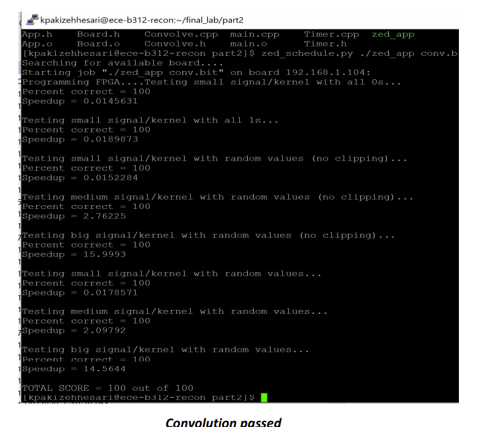

# Speedy-Convolve:
Created a 1D convolution pipeline that received data through a DRAM and stored output data to an output DRAM. 
## Challanges:
Input stream data is recived from a DRAM that operats on a different clock speed then the pipline. The soultion was to use a FIFO synchronization mechanisim to prevent metastability (error) on the input data. 
## Process: 
Used a smart buffer that allowed the throughput to be depended on the speed of the input stream rather then the execution of the pipline. The smart buffer outputed windows that were ready to the pipline and prevented reads of already obtained data. The output of the execution was then clipped and stored to an output external DRAM. 

## Results:

